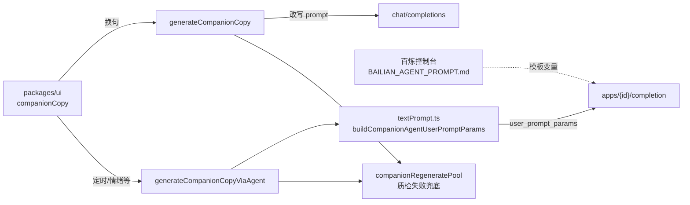

# 百炼 · 陪伴短句智能体（接入说明）

> **控制台系统提示词**：打开 [`BAILIAN_AGENT_PROMPT.md`](./BAILIAN_AGENT_PROMPT.md) → **全选复制** → 粘贴到百炼「应用配置 → 系统提示词」。该文件**仅含正文**，无 Markdown 标题或代码围栏。  
> 修改提示词：**先改 `BAILIAN_AGENT_PROMPT.md` → 提交仓库 → 再全选粘贴到百炼控制台**；变量名须与 `buildCompanionAgentUserPromptParams` 一致。

## 粘贴后检查

- 百炼应用内声明 **19 个**自定义变量（见下文表格，含 `scene_context`）；**勿**为 `style_guide` / `interest_guide` / `scene_context` 填写默认长文（由客户端每轮注入）。
- 系统提示词以 **【待改写】+ 改写任务** 为主（见 `BAILIAN_AGENT_PROMPT.md`）。
- **换一句 / 类似**：走 `chat/completions`（**改写屏上句**，短 prompt；不传兴趣、不注入参考锚句）；气泡与 API 返回一致。
- **昨日问候**（`yesterday-greeting` + `yesterday_context`）：走百炼 Agent（未配置 AppId 时回退 chat）。
- **今日小结收束**（保存后 `journal-closure` + `moment_context`）：走百炼 Agent。

## 调用关系

## `textPrompt.ts` 职责拆分

| 能力 | 智能体主路径 | chat 回退路径 |
|------|----------------|----------------|
| 系统提示词（短模板 + `{{变量}}`） | 百炼控制台 ← `BAILIAN_AGENT_PROMPT.md` | `buildCompanionSystemPrompt()` |
| 每轮动态变量 | `buildCompanionAgentUserPromptParams()` | 写入 system/user 片段 |
| 短任务 `input.prompt` | `buildCompanionAgentUserPrompt()` | `buildCompanionUserPrompt*` |
| 生成后套句/过短重试 | `refineCompanionCopyLine`（与 chat 共用） | 同左 |
| 百炼 session | **不传** `session_id`（每轮独立，防格言腔记忆） | N/A |
| 本地兜底句 | 套句时 `companionRegeneratePool` | 同左 |
| 情绪 → 语气 | `companionStyleForEmotion` → `text_style` | 同左 |

**勿删 `textPrompt.ts`**：回退、轻反馈、兜底过滤、变量组装仍依赖它；语气细则真源为 `STYLE_GUIDE` / `STYLE_ANTI_FUNCTIONAL`，经 `style_guide` 变量注入智能体。

## 相关代码

| 模块 | 路径 |
|------|------|
| 变量与 prompt 组装 | `packages/core/src/prompts/textPrompt.ts` |
| 智能体请求 | `packages/core/src/usecases/generateCompanionCopyViaAgent.ts` |
| chat 回退 | `packages/core/src/usecases/generateCompanionCopy.ts` |
| UI 路由 | `packages/ui/src/app/companionCopy.ts` |

环境变量：`VITE_BAILIAN_APP_ID`（陪伴短句应用 ID）。

## 响应里的 `model_id` 不是 Sidekick 选的

`apps/{id}/completion` 返回的 `usage.models[].model_id`（例如 `deepseek-v3.1`）来自**百炼应用里绑定的模型**，与 `VITE_DASHSCOPE_MODEL`（chat 回退）无关。

**经验**：DeepSeek 做「治愈短句」时极易复读「偶尔…发呆…」套句，即使用户提示词已禁止。建议百炼应用改绑 **Qwen-Plus / Qwen-Turbo**；若仍用 DeepSeek，客户端在判定套句后会**自动改走千问 chat**（Network 里可能先有一条 agent completion，气泡展示的是后续 chat 结果）。

客户端每轮仍会注入 `style_guide`、`writing_angle`（白名单句法）等变量；**控制台系统提示词未更新时，模型仍会按旧习惯写套句**。

套句若仍出现：优先检查控制台是否粘贴最新 `BAILIAN_AGENT_PROMPT.md`，且 **19 个变量齐全**（尤其 `writing_angle` 与 `avoid_recent_block` 勿写死默认值）。代码每轮只选**一种** `writing_angle`，并注入「与上一句对照」块；换句时自动选与上一句**不同句法类型**的 archetype。`writing_angle` 与 `avoid_recent_block` 使用同一 archetype，不再互相矛盾。

## 控制台自定义变量（19 个）

在百炼应用「自定义变量」中声明，名称与代码返回值键名**完全一致**：

| 变量名 | 含义 | 典型值 |
|--------|------|--------|
| `trigger` | 触发场景 | `scheduled` / `regenerate` / `similar` / `emotion` / `manual` / `yesterday-greeting` / `focus-end` / `unlock` / `journal-closure` / `streak-nudge` / `interest-deepen` |
| `scene_context` | **桌面挂件场景**（代码注入，勿写死） | 灵伴桌面气泡、默认未在读书等 |
| `text_style` | 语气类型标签 | `治愈` / `励志` / `搞笑` / `助眠` / `职场解压` / `抽象` / `鸡汤` / `沙雕` / `高冷` |
| `style_guide` | **当前语气全文**（由代码从 `STYLE_GUIDE` 注入） | 每轮一条，勿在控制台写死 |
| `interests` | 兴趣标签列表 | `音乐、影视` 或 `无` |
| `interest_guide` | **匹配兴趣的写作说明** | 由代码按标签拼接或 `无` |
| `interest_note` | 兴趣补充句 | 用户填写或 `无` |
| `light_feedback_hints` | 轻反馈归纳 | `；` 分隔或 `无` |
| `emotion_label` | 当前情绪 | `开心` / `焦虑` / `无` |
| `emotion_guide` | 情绪写作取向 | `EMOTION_GUIDE` 或 `无` |
| `yesterday_context` | 昨日情境 | 摘要或 `无昨日记录` |
| `moment_context` | 本轮情境 | 收束 / streak 等或 `无` |
| `similar_to_line` | 类似参考句 | 原文或 `无` |
| `local_time_hint` | 本地时段 | 如「工作日傍晚」（仅语境，不写禁词） |
| `writing_angle` | **气质参考（few-shot）** | 每轮 2 条随机示范句 +「勿照抄」；由代码注入，勿在控制台写死 |
| `writing_angle_index` | 句法索引 | `0`–`7` |
| `avoid_recent_block` | 防重复 | 近期句 + 起笔禁令或 `无` |
| `min_chars` | 最少汉字 | 如 `10` |
| `max_chars` | 最多汉字 | 如 `32` |
| `allow_emoji` | 是否 emoji | `是` / `否` |

另：`input.prompt` 由 `buildCompanionAgentUserPrompt()` 发送（含 trigger 细则与「仅简体中文」）。

## 维护流程（Agent / 人）

1. 改语气规则 → 先改 `textPrompt.ts` 中 `STYLE_GUIDE` / `STYLE_ANTI_FUNCTIONAL`（自动进入 `style_guide`）。
2. 改系统提示词骨架 → 改 [`BAILIAN_AGENT_PROMPT.md`](./BAILIAN_AGENT_PROMPT.md)。
3. 增删变量 → 同步 `buildCompanionAgentUserPromptParams`、本文表格、控制台变量声明。
4. **提醒维护者**：将 `BAILIAN_AGENT_PROMPT.md` **全文**粘贴到百炼「系统提示词」。

## 与今日小结 Agent 区分

日记引导 / 润色使用独立应用，见 [`BAILIAN_MOOD_JOURNAL_AGENTS.md`](./BAILIAN_MOOD_JOURNAL_AGENTS.md)。昨日问候走陪伴应用 `trigger=yesterday-greeting`。
