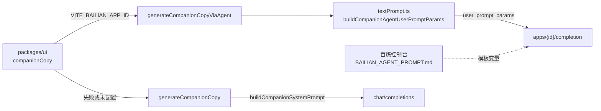

# 百炼 · 陪伴短句智能体（接入说明）

> **控制台系统提示词**：打开 [`BAILIAN_AGENT_PROMPT.md`](./BAILIAN_AGENT_PROMPT.md) → **全选复制** → 粘贴到百炼「应用配置 → 系统提示词」。该文件**仅含正文**，无 Markdown 标题或代码围栏。  
> 修改提示词：**先改 `BAILIAN_AGENT_PROMPT.md` → 提交仓库 → 再全选粘贴到百炼控制台**；变量名须与 `buildCompanionAgentUserPromptParams` 一致。

## 粘贴后检查

- 百炼应用内声明 **18 个**自定义变量（见下文表格）；**勿**为 `style_guide` / `interest_guide` 填写默认长文（由客户端每轮注入，含 `COMPANION_ANTI_TEMPLATE_BLOCK` 防套句块）。
- 系统提示词须含完整「防套句」章节（见 `BAILIAN_AGENT_PROMPT.md`）；仅改 `style_guide` 变量不够。
- 语气细则真源：`packages/core/src/prompts/textPrompt.ts` 中 `STYLE_GUIDE` / `STYLE_ANTI_FUNCTIONAL`。

## 调用关系

## `textPrompt.ts` 职责拆分

| 能力 | 智能体主路径 | chat 回退路径 |
|------|----------------|----------------|
| 系统提示词（短模板 + `{{变量}}`） | 百炼控制台 ← `BAILIAN_AGENT_PROMPT.md` | `buildCompanionSystemPrompt()` |
| 每轮动态变量 | `buildCompanionAgentUserPromptParams()` | 写入 system/user 片段 |
| 短任务 `input.prompt` | `buildCompanionAgentUserPrompt()` | `buildCompanionUserPrompt*` |
| 生成后套句/过短重试 | 无（控制台 + 客户端轻后处理） | `generateCompanionCopy` 多轮 retry |
| 本地兜底句 | `getCompanionText` → `fallback/quotes.ts` | 同左 |
| 情绪 → 语气 | `companionStyleForEmotion` → `text_style` | 同左 |

**勿删 `textPrompt.ts`**：回退、轻反馈、兜底过滤、变量组装仍依赖它；语气细则真源为 `STYLE_GUIDE` / `STYLE_ANTI_FUNCTIONAL`，经 `style_guide` 变量注入智能体。

## 相关代码

| 模块 | 路径 |
|------|------|
| 变量与 prompt 组装 | `packages/core/src/prompts/textPrompt.ts` |
| 智能体请求 | `packages/core/src/usecases/generateCompanionCopyViaAgent.ts` |
| chat 回退 | `packages/core/src/usecases/generateCompanionCopy.ts` |
| UI 路由 | `packages/ui/src/app/companionCopy.ts` |

环境变量：`VITE_BAILIAN_APP_ID`（陪伴短句应用 ID）。

## 控制台自定义变量（18 个）

在百炼应用「自定义变量」中声明，名称与代码返回值键名**完全一致**：

| 变量名 | 含义 | 典型值 |
|--------|------|--------|
| `trigger` | 触发场景 | `scheduled` / `regenerate` / `similar` / `emotion` / `manual` / `yesterday-greeting` / `focus-end` / `unlock` / `journal-closure` / `streak-nudge` / `interest-deepen` |
| `text_style` | 语气类型标签 | `治愈` / `励志` / `搞笑` / `助眠` / `职场解压` / `抽象` |
| `style_guide` | **当前语气全文**（由代码从 `STYLE_GUIDE` 注入） | 每轮一条，勿在控制台写死 |
| `interests` | 兴趣标签列表 | `音乐、影视` 或 `无` |
| `interest_guide` | **匹配兴趣的写作说明** | 由代码按标签拼接或 `无` |
| `interest_note` | 兴趣补充句 | 用户填写或 `无` |
| `light_feedback_hints` | 轻反馈归纳 | `；` 分隔或 `无` |
| `emotion_label` | 当前情绪 | `开心` / `焦虑` / `无` |
| `emotion_guide` | 情绪写作取向 | `EMOTION_GUIDE` 或 `无` |
| `yesterday_context` | 昨日情境 | 摘要或 `无昨日记录` |
| `moment_context` | 本轮情境 | 收束 / streak 等或 `无` |
| `similar_to_line` | 类似参考句 | 原文或 `无` |
| `local_time_hint` | 本地时段 | 如「工作日傍晚」 |
| `writing_angle` | 写法角度 | 多样性约束 |
| `avoid_recent_block` | 防重复 | 近期句 + 起笔禁令或 `无` |
| `min_chars` | 最少汉字 | 如 `10` |
| `max_chars` | 最多汉字 | 如 `32` |
| `allow_emoji` | 是否 emoji | `是` / `否` |

另：`input.prompt` 由 `buildCompanionAgentUserPrompt()` 发送（含 trigger 细则与「仅简体中文」）。

## 维护流程（Agent / 人）

1. 改语气规则 → 先改 `textPrompt.ts` 中 `STYLE_GUIDE` / `STYLE_ANTI_FUNCTIONAL`（自动进入 `style_guide`）。
2. 改系统提示词骨架 → 改 [`BAILIAN_AGENT_PROMPT.md`](./BAILIAN_AGENT_PROMPT.md)。
3. 增删变量 → 同步 `buildCompanionAgentUserPromptParams`、本文表格、控制台变量声明。
4. **提醒维护者**：将 `BAILIAN_AGENT_PROMPT.md` **全文**粘贴到百炼「系统提示词」。

## 与今日小结 Agent 区分

日记引导 / 润色使用独立应用，见 [`BAILIAN_MOOD_JOURNAL_AGENTS.md`](./BAILIAN_MOOD_JOURNAL_AGENTS.md)。昨日问候走陪伴应用 `trigger=yesterday-greeting`。
