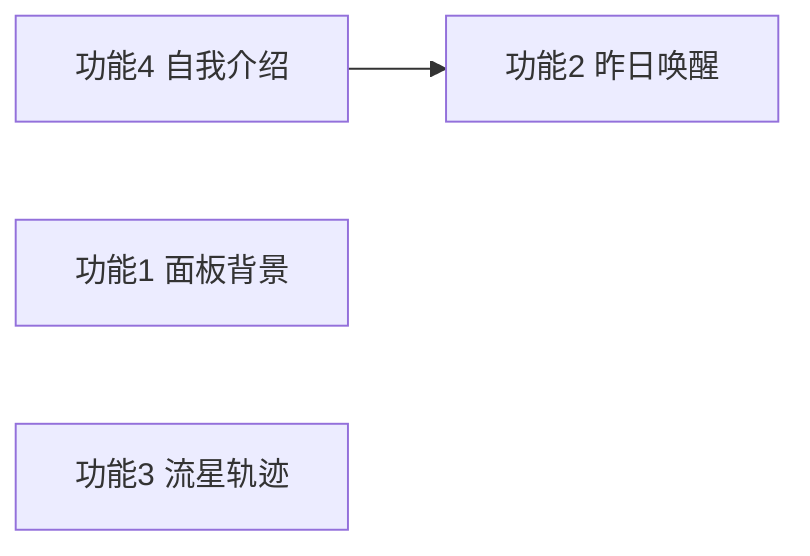

# Sidekick V1.1 功能规划与技术方案

> 文档版本：2026-05-16（已定稿决策）  
> 范围：自定义面板背景、昨日情绪唤醒文案、形象拖动流星轨迹、首次启动气泡自我介绍  
> 状态：**需求已定稿**，可进入开发排期  
> **平台**：仅 **Electron 桌面版**（不覆盖浏览器 `app` 模式、扩展）

---

## 0. 产品已定稿决策（2026-05-16）

| 议题 | 决策 |
|------|------|
| 面板背景 | **全部辅面板共用一套**背景（一张图/一个视频），不按面板各存一份 |
| 昨日唤醒 · 无数据 | 昨日无情绪/日记 → **不触发昨日唤醒**；**定时推送等默认陪伴文案照常** |
| 平台 | **仅电脑版（Electron）**；`powerMonitor` resume / unlock-screen 仅桌面实现 |
| 流星视觉 | **温柔风**，与现有紫罗兰 UI、圆角面板、治愈向气质一致（见 §5.2 设计规格） |
| 引导 vs 自我介绍 | **引导**（`OnboardingWizard`）= 设默认形象/语气/兴趣，与自我介绍无关；**自我介绍** = 气泡里一条长静态文案，介绍 App 功能与定位 |
| 自我介绍气泡 | **一条**长静态句；保留 `toastMode: intro` 与 **跳过 / 知道了**（单条时可只显示「知道了」） |

---

## 1. 背景与目标

Sidekick 当前已具备：多窗口 Electron 壳（`widget` / `toast` / `panel` / `onboarding`）、设置持久化（`localforage`）、情绪反馈（「此刻」`EmotionRecord` + 「今日小结」`MoodJournalEntry`）、陪伴气泡（`EmotionToast`）、首次引导窗（`OnboardingWizard`）。

V1.1 四项能力旨在提升**个性化**（背景）、**情境感**（昨日情绪续接）、**趣味性**（拖动流星）、**认知**（气泡内 App 自我介绍，与设置引导分离）。本文给出产品需求、技术方案、数据模型、分阶段交付与验收标准，便于评审与拆分任务。

### 1.1 不在本期范围（明确排除）

- 云同步背景/情绪数据
- 多设备账号体系
- 浏览器 `app` 模式、浏览器扩展 `packages/extension` 的同等能力
- 每面板独立背景
- 昨日无记录时仍弹「昨日专属」气泡（无记录则跳过该能力即可）
- 把自我介绍与引导窗合并为同一流程
- 流星轨迹跨屏物理模拟（仅挂件窗内视觉）

---

## 2. 现状锚点（代码地图）

| 能力 | 主要位置 |
|------|----------|
| 设置面板 | `packages/ui/src/components/settings/SettingsPanel.tsx` |
| 辅面板壳 | `packages/ui/src/app/AppPanelContent.tsx`，`panelShellClass` |
| 设置存储 | `packages/ui/src/state/settingsState.ts`，`settingsStorage.ts` |
| 情绪「此刻」 | `EmotionQuickFeedback` → `core` `appendEmotion` |
| 情绪「今日小结」 | `DailyMoodPanel` → `moodJournalStorage.ts` |
| 陪伴文案生成 | `packages/ui/src/app/companionCopy.ts`，`core` `generateCompanionCopy` |
| 定时推送 | `useScheduledCompanionPush.ts` |
| 精灵拖动 | `SpriteShell.tsx` → `sidekickDesktop.moveWidgetBy` |
| 气泡展示 | `EmotionToast` / `DetachedToastShell` / `WidgetSpriteLayer` |
| 首次引导 | `OnboardingWizard`，`onboarding` mode，`sidekick.onboarding.done` |
| 占位文案 | `SIDEKICK_MORE_FEATURES_PLACEHOLDER`（`constants/toastCopy.ts`） |
| 媒体大小限制参考 | `moodJournalMedia.ts`（12MB、类型白名单） |

---

## 3. 功能一：面板自定义图片/视频背景

### 3.1 产品需求

**用户故事**：我希望各个设置/功能面板能使用自己的图片或短视频作为背景，让界面更有个性。

**范围 · 共用一套背景**

所有 **`panel` 模式**辅窗读取**同一份** `PanelBackgroundMedia`（设置内上传一次，处处生效），包括但不限于：

| 入口 | 说明 |
|------|------|
| 设置 | 含侧栏六 Tab：推送、文案展示、语音、形象、AI、通用 |
| 换肤 | `skin` |
| 情绪反馈 | `emotion` |
| 每日抽签 | `fortune` |
| 收藏历史 | `favorites` |
| 首次引导窗 | `onboarding` — ⚪ 可选是否铺同一背景（默认可铺，与辅面板一致） |

**不适用**：桌面精灵 `widget`、独立气泡 `toast`（透明窗体）。

**交互**

- 设置 → **通用** 或新增 **外观** 分区：
  - 开关：启用自定义面板背景
  - 上传：图片或短视频（与今日小结媒体规则类似）
  - 预览缩略图 + 删除
  - 可选：模糊强度、遮罩透明度（保证文字可读性，默认开启半透明遮罩）
- 未上传时：保持现有 `sk-panel` 渐变/纯色背景。

**限制（建议默认值，可配置常量）**

| 项 | 建议值 | 说明 |
|----|--------|------|
| 单文件大小 | ≤ 12 MB | 与 `moodJournalMedia` 一致 |
| 图片类型 | png / jpeg / webp / gif | gif 按静图或短动画处理 |
| 视频类型 | mp4 / webm | 面板内 `muted` `loop` `playsInline` |
| 存储 | IndexedDB data URL 或 Blob URL | 与心情附件相同策略，避免撑爆 `settings` JSON |
| 分辨率建议 | 长边 ≤ 1920px | 上传后可选客户端压缩（Phase 2） |

### 3.2 技术方案

**数据模型**（`settings` 扩展或独立 store）：

```ts
type PanelBackgroundMedia = {
  id: string
  type: 'image' | 'video'
  mimeType: string
  dataUrl: string // 或 object URL + 独立 blob store
  name: string
  updatedAt: string
}

// SidekickSettings 新增字段示例
panelBackgroundEnabled: boolean
panelBackgroundBlurPx: number      // 0–12，默认 0
panelBackgroundOverlayOpacity: number // 0.3–0.7，默认 0.45
// 媒体本体存 localforage storeName: 'panelBackground'，settings 只存 enabled + 样式参数
```

**UI 实现**

1. 新建 `PanelBackgroundPicker.tsx`（可复用 `MoodSummaryMediaPicker` 的上传/校验逻辑，抽公共 `mediaUploadUtils.ts`）。
2. 在 `AppPanelContent` 或 `panelShellClass` 外包一层 `PanelBackgroundLayer`：
   - `position: absolute; inset: 0; z-index: 0`
   - 内容区 `relative z-10` + `backdrop` 或渐变遮罩
3. **可读性**：背景上强制 `bg-white/80` 或动态遮罩，满足 WCAG 对比度抽检（正文区域不低于 AA）。

**Electron**

- `panel` 模式 BrowserWindow 可不透明；背景仅渲染在 React 层，无需改 `backgroundColor`。
- 跨窗口：设置变更后 `broadcastSettingsSync` + 可选 `panelBackground` 专用广播。

**风险**

- data URL 过大导致面板窗启动慢 → 优先 Blob + IndexedDB，面板 mount 时异步 hydrate。
- 视频耗电 → 设置项「仅静态图」或「视频仅 Wi-Fi」（后续）。

### 3.3 验收标准

- [ ] 开启背景后，设置（六 Tab）、换肤、情绪、抽签、收藏等辅窗**视觉一致**（同一媒体）
- [ ] 超过 12MB / 非法类型有明确错误提示
- [ ] 删除背景后恢复默认样式，无残留 Blob URL 泄漏
- [ ] 深色模式与背景叠加后文字仍可读

---

## 4. 功能二：当日首次打开 / 屏幕激活 → 昨日情绪文案

### 4.1 产品需求

**用户故事**：每天第一次打开应用，或电脑从休眠唤醒时，陪伴气泡能根据**昨天**的情绪记录，说一句更贴切的问候/续接，而不是普通定时推送。

**触发条件（Electron 桌面版）**

| 触发 | 说明 | 默认 |
|------|------|------|
| 当日首次进入可推送状态 | 本地日 `dayKey` 变更后，第一次满足 `onboardingDone && pushEnabled && !focusSession` | ✅ |
| 屏幕解锁 / 系统 resume | `powerMonitor` `resume` 或 `unlock-screen` | ✅（设置可关） |
| 浏览器 `visibilitychange` | **不做** | ❌ |
| 每次定时推送 | 不替代 `useScheduledCompanionPush` | ❌ |

**无昨日数据**：`buildYesterdayContext()` 返回 `null` → **仅跳过「昨日唤醒」**；不生成昨日向 prompt，**不占用**当日唤醒名额的替代句。用户仍会通过 **`useScheduledCompanionPush` 等既有链路**收到默认陪伴推送文案（与平时一致）。

**「昨日情绪」数据源（优先级）**

1. **今日小结**：`moodJournal` 中 `dayKey === yesterday` 的 `MoodJournalEntry`（`moodLabel` + `note` 摘要）。
2. **此刻反馈**：`emotion.records` 中 `createdAt` 落在昨日的记录（取最后一条或聚合成主导 `EmotionKind`）。
3. 两者皆有：小结优先；可在 prompt 中同时注入「日记一句 + 标签」。

**文案策略**

- 调用现有 `generateCompanionCopy`，新增 system 片段：`yesterdayMoodContext`（昨日标签、可选 note 前 40 字）。
- API 失败时：可降级为本地模板 + 昨日标签。
- **无昨日记录**：不跑昨日唤醒逻辑；**不**发昨日向气泡，也**不**阻止正常推送。
- 每日最多展示 **1 次**「昨日唤醒」气泡（`lastYesterdayGreetingDayKey`）。

**设置项（设置 → 文案展示 或 推送）**

- 开关：启用「昨日情绪唤醒」
- 开关：系统在休眠恢复时也触发（仅 Electron）
- 与勿扰/专注：`quietHours`、`focusSessionUntilEpochMs` 仍生效

### 4.2 技术方案

**新建模块** `packages/ui/src/app/useYesterdayEmotionGreeting.ts`：

```
onTrigger():
  if (!enabled || !onboardingDone || focusActive || quietHours → return
  if (lastGreetingDayKey === today) → return
  const ctx = await buildYesterdayContext() // mood journal + emotion records
  if (!ctx) → return // 无昨日数据：跳过昨日唤醒，定时推送照常
  const text = await requestCompanionCopy({ yesterdayContext: ctx, ... })
  showToastMessage(text, { source: 'yesterday-greeting' })
  markGreetingShown(today)
```

**`buildYesterdayContext()`**

```ts
function localYesterdayKey(): string { /* dayKey - 1 */ }

async function buildYesterdayContext(): Promise<YesterdayContext | null> {
  const y = localYesterdayKey()
  const mood = await getMoodEntryForDay(y)
  const emotions = filterEmotionRecordsForDay(emotionRecords, y)
  if (!mood && emotions.length === 0) return null
  return { moodLabel, moodLevel, notePreview, dominantEmotion, ... }
}
```

**Core / Prompt**（`packages/core/src/prompts/textPrompt.ts`）

- 扩展 `generateCompanionCopy` 入参：`yesterdayContext?: { ... }`
- 规则示例：「用户昨日整体心情偏 {label}，日记提及 {notePreview}，请写一句 20–32 字的延续关怀，勿重复说教。」

**Electron 主进程**（`ipcHandlers.mjs`）

- 监听 `powerMonitor.on('resume')` / `unlock-screen'`
- `spriteWindow.webContents.send('sidekick:system-resume')`
- Preload 暴露订阅；`widget` 模式 `App.tsx` 注册 handler → 调用 `useYesterdayEmotionGreeting`

**与定时推送关系**

- 昨日唤醒与 `useScheduledCompanionPush` 互斥窗口：触发后 N 分钟内跳过下一次定时推送（建议 2–5 分钟），避免连弹两条。

### 4.3 验收标准

- [ ] 昨日有「今日小结」时，气泡文案明显引用昨日心情或日记关键词
- [ ] 同日第二次唤醒/打开不再重复（除非用户清除标记）
- [ ] 昨日无记录时**不出现昨日唤醒气泡**，但定时推送仍正常
- [ ] 勿扰时段、专注模式、未完成 onboarding 时不触发
- [ ] 仅在 Electron 挂件进程验证 resume 触发

---

## 5. 功能三：形象拖动流星轨迹（1–3s）

### 5.1 产品需求

**用户故事**：拖动桌面精灵时，身后出现短暂流星/拖尾特效，持续约 1–3 秒后消失，增强「活物感」。

**行为细则**

| 项 | 说明 |
|----|------|
| 显示时机 | `SpriteShell` 拖动超过阈值 `POINTER_DRAG_THRESHOLD_PX`（6px）后 |
| 持续时间 | 松手后轨迹在 **1–3s** 内淡出（可随机 1.2–2.8s 增加自然感） |
| 强度 | 设置 → 形象：**拖动流星特效** 开/关；尊重 `motionEnabled`（关则禁用） |
| 性能 | 挂件窗内 Canvas/CSS，不影响 `moveWidgetBy` 节流 |
| 穿透 | 特效层 `pointer-events: none` |

### 5.2 技术方案

**方案 A（推荐）：Canvas 粒子层**

- 在 `WidgetSpriteLayer` 增加 `<SpriteDragTrailCanvas />`，`position: fixed; inset: 0; z-index: 5; pointer-events: none`
- `SpriteShell` 在 `pointermove`（已过阈值）时 `dispatchTrailPoint({ x, y, t })`
- 松手后不再新增点，仅衰减旧点；**1–3s**（建议随机 1.2–2.8s）内 alpha → 0

**温柔风视觉规格（对齐当前产品）**

与设置面板、气泡工具栏一致的 **violet + slate** 气质，避免霓虹、硬核科幻：

| 令牌 | 值 | 用途 |
|------|-----|------|
| 拖尾主色 | `#a78bfa` → `#c4b5fd` 渐变 | 对应 `violet-400` / `violet-300` |
| 核心高光 | `#f5f3ff` 15–25% opacity | 柔和光点，非刺眼白 |
| 尾迹宽度 | 2–3px，末端 0px | `lineCap: round`，`globalCompositeOperation: lighter` 轻微叠亮 |
| 粒子 | 每帧 ≤ 48 点，间距采样 ≥ 8px | 低密度，像「星尘」非烟花 |
| 模糊 | `shadowBlur` 6–10 或离屏模糊 | 边缘羽化 |
| 动效曲线 | ease-out 淡出 | 尊重 `prefers-reduced-motion` / `motionEnabled` → 关闭 |
| 参考气质 | 现有圆角白面板、紫色描边 chip、治愈短句 | 与「灵伴」陪伴感一致，不用尖锐彗星头 |

**方案 B：CSS 多段 div 尾迹** — 不推荐（性能差）。

**坐标系**

- 使用挂件窗口客户区坐标；`moveWidgetBy` 与 trail 同源 `clientX/clientY`。
- 高 DPI：`devicePixelRatio` 缩放 Canvas。

**与 Electron 关系**

- 纯渲染端，无需 IPC；若未来精灵窗 GPU 合成有问题，可加设置降级为「简单光点」。

**伪代码**

```ts
// trailStore: RingBuffer<TrailPoint>(max 80)
onPointerMove: if (dragging) push({ x, y, age: 0 })
onAnimationFrame: 
  age all points
  drop where age > 3000ms
  draw streaks
```

### 5.3 验收标准

- [ ] 拖动时可见流星拖尾，松手后 1–3s 内消失
- [ ] `motionEnabled === false` 或设置关闭时无特效
- [ ] `interactionLocked` 时不产生轨迹
- [ ] 长时间拖动不导致内存持续增长（点队列有上限）
- [ ] 60fps 目标下挂件 CPU 占用可接受（需真机 profiling）

---

## 6. 功能四：首次启动 — 气泡自我介绍（与引导分离）

### 6.1 产品需求

**用户故事**：新用户需要知道「灵伴是什么、能做什么」——用**一条较长的静态自我介绍**在陪伴气泡里展示，而不是 V1.1 占位句。

**引导 ≠ 自我介绍（务必区分）**

| 能力 | 载体 | 目的 | V1.1 |
|------|------|------|------|
| **引导** | 独立 `OnboardingWizard` 窗 | 设置默认形象、文案风格、兴趣标签 | **保持现状**，不负责介绍功能 |
| **自我介绍** | 陪伴 `EmotionToast` 气泡 | 向用户说明 App **定位与功能**（桌面陪伴、定时句、情绪/今日心情、换肤设置等） | **新增** |

二者**无内容耦合**：引导完成 ≠ 引导文案写入气泡；自我介绍在引导结束后**单独**弹出一次。

**展示形式**

- **一条**长静态中文（建议 80–160 字，可 `whitespace-pre-wrap` 分段排版），示例方向：
  > 我是桌面上的陪伴精灵「灵伴」：会按你的设置定时说一句短陪伴话，你可以点正文换句、收藏喜欢的句子。菜单里可以记录此刻心情、写今日小结、换形象和调整推送与语音。我住在屏幕一角，拖动可换位，目的是轻轻陪陪你，而不是打扰你。
- 不调 DashScope；写入 `appSelfIntroCopy.ts`。
- `dwellSeconds: 0` 或较长停留，直至用户点 **知道了** / 关闭。

**交互（保留 intro 态 UI）**

- `EmotionToast` / `uiState`：`toastMode: 'intro' | 'normal'`。
- 自我介绍态（`intro`）：
  - 文案区展示上述**长句**；
  - 文案下方或工具栏上方：**跳过**（等同关闭并标记已读）、**知道了**（主按钮；仅一条时可不显示「下一条」）；
  - 轻反馈（喜欢/一般/少推）**隐藏**；工具栏可保留复制/菜单等，或精简为关闭 + 设置（实现时二选一，默认保留关闭与菜单）。
- 首启展示期间：**暂停**定时推送与昨日唤醒；关闭后恢复。
- 设置 → 通用：**重温产品介绍**（再次以 `intro` 态展示同一条长文案）。
- 菜单「更多」里的 `SIDEKICK_MORE_FEATURES_PLACEHOLDER` **可保留**，与首启自我介绍无关。

**触发时机**

- `onboardingDone` 首次变为 `true` 后延迟 ~500ms（精灵/气泡窗就绪）；
- 若 `appSelfIntroShown` 已标记则不再自动弹出。

### 6.2 技术方案

**状态**

```ts
sidekick.appSelfIntroShown.v1: '1' | null
```

**模块** `useAppSelfIntroBubble.ts`

```
onboardingDone 首次 true && !appSelfIntroShown:
  pauseScheduledPush = true
  showToastMessage(APP_SELF_INTRO_LONG_COPY, {
    toastMode: 'intro',
    dwellSeconds: 0,
  })
  // 用户点「知道了」或跳过 → markAppSelfIntroShown(); pauseScheduledPush = false
```

**文案**

- `packages/ui/src/constants/appSelfIntroCopy.ts`：导出单条 `APP_SELF_INTRO_LONG_COPY: string`。

**Toast 改动**

- `uiState` / `SHOW_TOAST` payload 支持 `toastMode?: 'intro'`
- `EmotionToastCard`：`toastMode === 'intro'` 时渲染 `IntroToastChrome`（跳过 / 知道了）
- 单条长文案时隐藏「下一条」，保留跳过与知道了

### 6.3 验收标准

- [ ] 引导窗与自我介绍内容无重叠要求（引导仍只设默认值）
- [ ] 首启自动弹出**一条**长自我介绍，带跳过/知道了
- [ ] 关闭后定时推送恢复正常
- [ ] 首启第一条**不是**「更多功能将在 V1.1 解锁」
- [ ] 设置中可手动重温同一条自我介绍

---

## 7. 跨功能依赖与实施顺序



| 阶段 | 内容 | 预估 |
|------|------|------|
| **P0** | 功能 4：长文案自我介绍 + `toastMode: intro` + 跳过/知道了 | **3–4 人日** |
| **P1** | 功能 2：昨日上下文 + 触发器 + prompt | 4–6 人日 |
| **P1** | 功能 3：Canvas 轨迹 + 设置开关 | 2–4 人日 |
| **P2** | 功能 1：背景上传 + 面板层 + 压缩优化 | 4–6 人日 |

**建议顺序理由**：功能 4（intro 气泡 UI）与功能 2 共享推送暂停；背景独立；流星可并行。

---

## 8. 设置项汇总（拟新增）

| 设置键 | 类型 | 默认 | 所属 Tab |
|--------|------|------|----------|
| `panelBackgroundEnabled` | boolean | false | 通用/外观 |
| `panelBackgroundOverlayOpacity` | number | 0.45 | 通用/外观 |
| `yesterdayGreetingEnabled` | boolean | true | 文案展示 |
| `yesterdayGreetingOnResume` | boolean | true | 推送 |
| `spriteDragTrailEnabled` | boolean | true | 形象 |
| `appSelfIntroShown` | — | 独立 key `sidekick.appSelfIntroShown.v1` | — |

---

## 9. 测试计划

| 类型 | 覆盖 |
|------|------|
| 单元 | `buildYesterdayContext`、`localYesterdayKey`、媒体校验、trail 点队列衰减 |
| 组件 | `PanelBackgroundLayer` 遮罩 |
| E2E（Electron） | 上传背景 → 多辅窗同图；resume 有昨日数据才弹；拖动温柔流星；首启文案序列 |
| 性能 | 大背景 data URL 面板打开耗时；拖动 30s 内存 |

---

## 10. 已定稿决策（归档）

见文档开头 **§0**；2026-05-16 产品确认，后续变更请更新 §0 并修订对应章节。

---

## 11. 附录：关键文件改动清单（实施时参考）

| 功能 | 新增/修改文件（预期） |
|------|------------------------|
| 背景 | `PanelBackgroundLayer.tsx`，`panelBackgroundStorage.ts`，`SettingsPanel` 外观区，`settingsState.ts` |
| 昨日唤醒 | `useYesterdayEmotionGreeting.ts`，`textPrompt.ts`，`generateCompanionCopy.ts`，`ipcHandlers.mjs`，`preload.cjs` |
| 流星 | `SpriteDragTrailCanvas.tsx`，`SpriteShell.tsx`，`settingsState.ts` |
| 自我介绍 | `appSelfIntroCopy.ts`，`useAppSelfIntroBubble.ts`，`IntroToastChrome.tsx`，`uiState`（`toastMode`），`EmotionToastCard.tsx` |

---

*文档维护：功能评审后更新「开放问题」与排期；实现中以 PR 勾选本节验收标准。*
